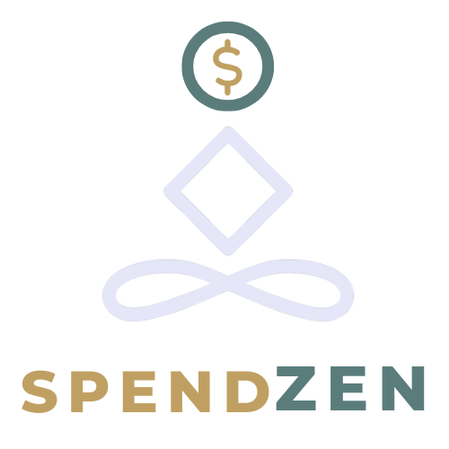

# Spendzen 🧘‍♂️💸

<p align="center">
  
</p>

<h3 align="center">Spend with intention. Save with purpose.</h3>

<p align="center">
  <a href="https://github.com/John4E656F/SpendZen/blob/main/LICENSE">
    
  </a>
  <a href="https://github.com/John4E656F/SpendZen/issues">
    
  </a>
  <a href="https://github.com/John4E656F/SpendZen/stargazers">
    
  </a>
</p>

---

## 🤔 About The Project

In a world of one-click purchases and targeted ads, it's easy to lose track of our long-term financial goals. We often make impulse buys driven by **_wants_** rather than **_needs_**, creating a disconnect between our daily spending and our future aspirations.

**Spendzen** is here to bridge that gap. It's not just another budgeting app; it's your personal _decision-making coach_. By introducing a moment of mindful pause and guided reflection, Spendzen helps you understand the **why** behind your purchases. Our Socratic AI engages you in a simple conversation to determine if a purchase aligns with your values and goals, helping you build healthier financial habits from the ground up.

> Our core philosophy is built on **Awareness over Restriction**. We empower you with clarity, so every purchase becomes an intentional choice.

---

## ✨ Core Features

- 🤖 **Socratic AI Coach:** Engage in a thoughtful conversation with an AI designed to help you differentiate between a "want" and a "need," and even suggest better alternatives.
- 🎯 **Goal-Oriented Tracking:** Define what you're saving for (a vacation, a down payment, etc.) and see in real-time how skipping a purchase brings you closer to your dreams.
- 📊 **Mindful Savings Log:** A visual log of all the money you've saved by making intentional choices, providing powerful positive reinforcement.
- 🎁 **Smart Suggestions:** The AI can help you find better, cheaper, or more meaningful alternatives for purchases, including gifts.
- 🤔 **The "Purchase Pause":** Implement a "cooling-off" period for non-essential items, giving you time to reflect before you buy.

---

## 🛠️ Tech Stack

This project is built with a modern, scalable tech stack.

- **Frontend:** Expo React Native
- **Language:** TypeScript
- **Styling:** Tailwind CSS
- **Database:** MongoDB
- **AI:** Google Gemini / OpenAI

---

## 🚀 Getting Started

This is an [Expo](https://expo.dev) project created with [`create-expo-app`](https://www.npmjs.com/package/create-expo-app). Follow the steps below to get a local copy up and running.

### 1. Clone the Project & Install Dependencies

First, clone the repository to your local machine.

```bash
git clone [https://github.com/your_username/spendzen.git](https://github.com/your_username/spendzen.git)
cd spendzen
```
